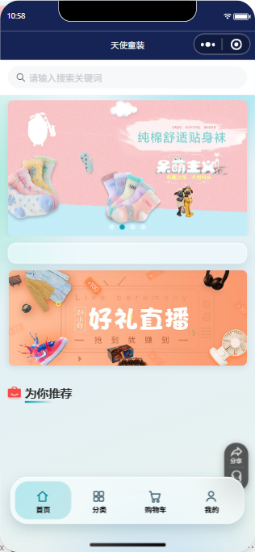
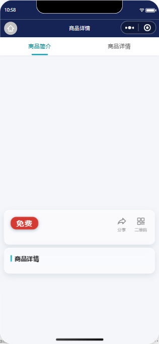
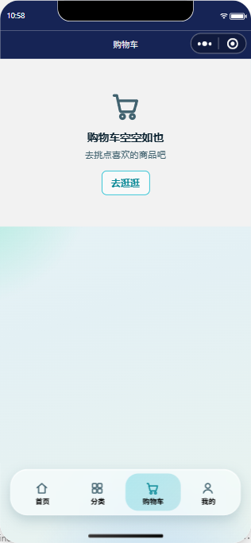
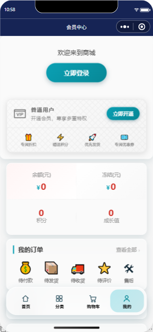

# Aqua UI WeApp

Liquid Glass 浅底版微信小程序原生组件库——零依赖、零构建、纯 WXML Component。

[English README](README.en.md)

## 这是什么

一套为微信小程序原生环境（WXML/WXSS）写的组件库：磨砂玻璃卡片、弥散渐变水底、悬浮胶囊导航。不依赖 Tailwind、不需要构建链，拷贝 `components/` ＋ `styles/tokens.wxss` 即可用。

设计原则（实测 WCAG 对比度定色，非拍脑袋）：

- **户外强光约束**：内容区永远浅底深字（田间/船头场景）
- **亮青关在笼子里**:`#13ecf3` 只许出现在藏青 `#162455` 底上（压白底 1.6:1 残废，压藏青 12:1)
- **语义色稳定**：确认绿/待办橙/危险红跨端一致

## 实机效果（电商示例 aqua-shop-weapp，真机模拟器实拍）

## 快速开始

1. 拷贝 `components/` 到你的小程序根目录，`styles/tokens.wxss` 在 `app.wxss` 顶部 `@import` 或合并
2. 页面 json 声明组件，例如 `"usingComponents": {"bd-card": "/components/bd-card/bd-card"}`
3. 页面根节点套 `.mesh`，卡片用 `<bd-card>` 或直接 `.glass`

## 组件（11)

| 组件 | 用途 |
|---|---|
| bd-page | mesh 背景＋安全区＋可选 navy chrome 槽 |
| bd-button | primary（青渐变）/ghost（玻璃描边）/danger（降级描边）,loading/disabled,lg/md |
| bd-card | 玻璃卡，padding normal/compact/flush,title 属性或命名 slot |
| bd-list-row | 图标＋主/副标题＋状态位，按压态 |
| bd-chip | 语义徽标（ok/warn/info/neutral/danger) |
| bd-icon | 14 名内联 SVG 集（fish/camera/warn/home/plus/user/grid/list/flag/chevron/check/empty-doc/location/clock) |
| bd-empty-state | 空态四场景（无数据/未绑定/404/错误）,icon＋title＋desc＋可选动作 |
| bd-field | 表单域：label＋必填星＋control slot＋hint/error |
| bd-photo-uploader | 虚线框＋相机图标＋计数＋九宫格预览＋删除＋满员禁用 |
| bd-skeleton | 列表骨架行（rows 可控，卡片包裹或裸行） |
| dock | 悬浮胶囊导航，按身份渲染项数，选中态胶囊 |

## 设计令牌

全部色值与实测对比度见 [docs/design-tokens.md](docs/design-tokens.md)。

## 示例

`demo/`——电商小程序示例（最大类目，商品网格/详情/购物车/订单确认），持续落地中；活体样板见 [aqua-shop-weapp](https://github.com/getaskclaw/aqua-shop-weapp)。

## License

Apache-2.0
